***The Reading Room** is a (fictitious) book review 'club' website providing reviews on a range of books and book categories.
The idea for this project is to provide the visitor with an interactive website allowing registered users to create new book reviews for the enjoyment of all site visitors.
If a visitor likes a book review, they are able to select a hyperlink to an online retailer's website, where they are able to purchase a copy of the book.*


***Please note: This is only to simulate an affiliate marketing business model for educational purposes and in no way endorses or implies a business relationship with the chosen retailers.***


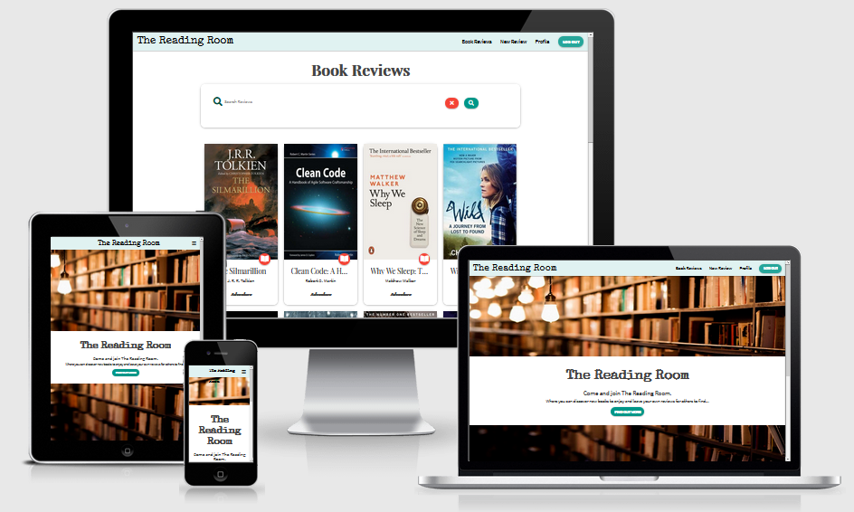 

*I created the The Readng Room logo to present an intuitive image based on research of similar contemporary book review blog websites (details of these websites can be found in the Credits section). The muted, almost monochromatic colour scheme was chosen for a clean simple site allowing the reviews to be the main focus.*


---

### **Contents** ###

- [UX (User Experience)](#ux-user-experience)
  - [Project Goals](#project-goals)
  - [User Goals](#user-goals)
  - [User Stories](#user-stories)
  - [Site Owner Goals](#site-owner-goals)
- [Design Choices](#design-choices)
  - [Fonts](#fonts)
  - [Colours](#colours)
  - [Wireframes](#wireframes)
    - [Hand drawn drafts](#hand-drawn-drafts)
    - [Final Wireframes](#final-wireframes)
- [Technologies](#technologies)
  - [Languages](#languages)
  - [Database](#database)
  - [Libraries](#libraries)
  - [Tools](#tools)
- [Features](#features)
  - [Features Implemented](#features-implemented)
  - [Responsive Design](#responsive-design)
  - [Topology](#topology)
  - [Interactive Elements](#interactive-elements)
  - [Future Features](#future-features)
  - [Site Construction](#site-construction)
  - [Page Layout](#page-layout)
  - [Construction Table](#construction-table)
  - [Database Design](#database-design)
    - [genre Collection](#genre-collection)
    - [users Collection](#users-collection)
    - [privacy Collection](#privacy-collection)
    - [terms_conditions Collection](#terms_conditions-collection)
    - [Data Types](#data-types)
- [SEO](#seo)
    - [HTML Sitemap links](#html-sitemap-links)
    - [XML Sitemap file](#xml-sitemap-file)
    - [Google Search Console](#google-search-console)
- [Project Management](#project-management)
- [Version Control](#version-control)
    - [Gitpod Workspaces](#gitpod-workspaces)
    - [Branches](#branches)
    - [Working within a branch](#working-within-a-branch)
    - [Merging branches in GitHub](#merging-branches-in-github)
    - [Update Gitpod with the latest GitHub commits](#update-gitpod-with-the-latest-github-commits)
- [Testing](#testing)
- [Bugs](#bugs)
- [Deployment](#deployment)
  - [Cloning the-reading-room from GitHub](#cloning-the-reading-room-from-github)
    - [Prerequisites](#prerequisites)
    - [Cloning the GitHub repository](#cloning-the-github-repository)
    - [Creation of a Python Virtual Environment](#creation-of-a-python-virtual-environment)
    - [Install the App dependencies and external libraries](#install-the-app-dependencies-and-external-libraries)
    - [Create the database in MongoDB](#create-the-database-in-mongodb)
    - [Create `env.py` file](#create-env.py-file)
    - [Run the application](#run-the-application)
  - [Deploying The Reading Room app to Heroku](#deploying-the-reading-room-app-to-heroku)
    - [Create the Heroku App](#create-the-heroku-app)
    - [Push your repository to GitHub](#push-your-repository-to-github)
    - [Connect Heroku to GitHub](#connect-heroku-to-github)
    - [Launch the App](#launch-the-app)
- [Credits](#credits)
  - [Images](#images)
  - [Colour](#colour)
  - [Inspiration](#inspiration)
  - [Acknowledgements](#acknowledgements)


---

## UX (User Experience) ##

### **Project Goals** ###

The **goal** of this project is to build a a website that allows site visitors to read book reviews created by registered users and to find links to online retailers to purchase books they like.


The **features** on the website will:

- Show an interactive list of book reviews containing book details and short user reviews for all site visitors.
- Provide links to online retailers for the associated books reviewed.
- Allow visitors to register a user account to log in to the site and create their own book reviews for others to see and read.

I achieve this by:

- Providing a Registration form with username and password for users to create an account
- Providing a log in page for existing users to log in to their account
- Enabling users who are logged in to create new book reviews or edit their own previous book reviews.

### **User Goals** ###

- **Read** book reviews created by other users.
- **Create** book reviews for others to read.
- **Link** to online retailers to purchase the books they like.

### **User Stories** ###


#### **New Site Visitor** ####

- As a **user**, I want to see a **navigation bar** at the top of the page where I can navigate to each of the different site pages.
- As a **user**, I can see a **collapsed navigation bar icon** on mobile devices that opens up to give access to the site navigation links when clicked.
- As a **user**, I can see a **site logo** or name in the navigation bar.
- As a **user**, I can see a **hero image** welcoming the user to the site.
- As a **user**, I can see **Call To Actions (CTA)** to learn more about the book reviews available.
- As a **user**, I want to see a page containing **all** the available book reviews.
- As a **user**, I want to be able to search for book reviews.
- As a **user**, I want to click on a **book review** to see more details about the book.
- As a **user**, I want to be able to click **links** to **online retailers** to purchase the reviewed books.
- As a **user**, I want to **register** a username and password to **log in** to the site.
- As a **user**, I can see the website **privacy policy** and **terms and conditions**.
- As a **user**, I can see a **site map** with **links** to all the site pages.
- As a **user**, I can contact the site owner(s) using their **social media** channels.


#### **Returning Site Visitor** ####

- As a **user**, I want to see my user account profile page.
- As a **user**, I want to be able to click on a book review favourite button to save my favourite reviews.
- As a **user**, I want to create, edit or delete my own book reviews.
- As a **user**, I want to be able to wite a comment on a book review.


#### **Site Administrator** ####

- As an **Administrator**, I want to be able to add, edit and delete the book rewiew genre categories


### **Site Owner Goals** ###

- As a **site owner**, I want to create an **interactive website** allowing the user to easily understand the site's purpose and features.
- As a **site owner**, I want the visitor to create a user account with a password to log in and access more site features.
- As a **site owner**, I want the user to be able to log out of their account.
- As a **site owner**, I want an ADMIN user account to administer the site content.


[Back to contents](#contents)

--- 

## Design Choices ##

### **Topology** ###


### **Fonts** ###

I've chosen fonts that complement eachother using a combination of serif and sans-serif fonts to lend a feeling of printed words on a page or in a book.


The fonts I have chosed for this are [Playfair Display](https://fonts.google.com/specimen/Playfair+Display?query=playfa&preview.text_type=custom&selection.family=Special+Elite) 
for the headings and [Source Sans Pro](https://fonts.google.com/specimen/Source+Sans+Pro?query=source+sans&preview.text_type=custom&selection.family=Playfair+Display&sidebar.open=true) 
for the body text.


The Logo font was created using [Special Elite](https://fonts.google.com/specimen/Special+Elite?query=special&preview.text_type=custom&sidebar.open=true&selection.family=Special+Elite) 
to give the look of an old typewriter. This is also used for the error handling messages and the titles in the footer.

### **Colours** ###

I've chosen the colours from the Materialize CSS [teal](https://materializecss.com/color.html) palette to give a clean light feel with pastel shades. This gives some separation for the
different page sections without overpowering the layout and taking the focus away from the book reviews.


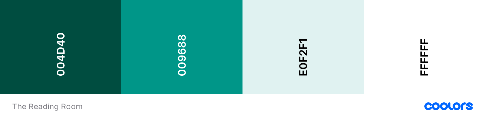

- *Teal Darken-4* (004D40) - Dark Teal Green
- *Teal* (009688) - Teal Green
- *Teal Lighten-5* (E0F2F1) - Very Pale Teal Green
- *White* (FFFFFF) - White


These colours will compliment each other well to create a calm but visually pleasing accent to the white background of the site.

### **Wireframes** ###

I designed the site mock-ups originally using pen and paper and then developing the designs further using [Balsamiq wireframes](https://balsamiq.com/).

I focussed on defining the basic layout structure of the site and identified how displays would change on different screen sizes such as mobile, tablet and desktop for each page.

#### Hand drawn drafts ####

The original hand drawn sketch wireframe was created as quick and rough method to try out page formatting ideas to form a basis for creating the wireframe within balsamic.

It represents the early stages of the design process for the website as ideas started to form and the flow of the design process from idea to finished website.
- [Homepage](wireframes/original-drafts/wireframe-mobile-1.png)
- [Book Review](wireframes/original-drafts/wireframe-mobile-1.png)
- [Book Page](wireframes/original-drafts/wireframe-mobile-4.png)
- [Register](wireframes/original-drafts/wireframe-mobile-2.png)
- [Log In](wireframes/original-drafts/wireframe-mobile-2.png)
- [Add Review](wireframes/original-drafts/wireframe-mobile-3.png)
- [Manage Categories](wireframes/original-drafts/wireframe-mobile-3.png)


#### Final Wireframes ####

The final wireframes were created using Balsamiq adapted from the original hand drawn wireframe concepts. The image shows the homepage from the site in three display sizes to demonstrate the responsive page design and layout.

- [Homepage](wireframes/home-page.png)
- [Register](wireframes/register.png)
- [Log In](wireframes/log-in.png)
- [Book Reviews Page](wireframes/book-review-page.png)
- [Book Page](wireframes/book-page.png)
- [Add Review](wireframes/add-review.png)
- [Edit Review](wireframes/edit-review.png)
- [Manage Genres](wireframes/manage-categories.png)
- [Add Genre](wireframes/add-category.png)
- [Add Comment](wireframes/add-comment.png)
- [Profile Page](wireframes/profile.png)
- [Privacy Policy](wireframes/priacy-policy.png)
- [Terms & Conditions](wireframes/terms-conditions.png)


[Back to contents](#contents)

---  

## Technologies ##

### **Languages** ###

- [Python3](https://www.python.org/)
  - Used to create the main application functionality
- [HTML5](https://developer.mozilla.org/en-US/docs/Web/HTML)
  - Used as the main markup language for the website content.
- [CSS3](https://developer.mozilla.org/en-US/docs/Web/CSS)
  - Used to style the individual webpages.
- [JavaScript](https://developer.mozilla.org/en-US/docs/Web/JavaScript)
  - Used to create the interactive functionality of the website


### **Database** ###

- [MongoDB Atlas](https://www.mongodb.com/)
  - Cloud based document-oriented database used to store the backend data.

### **Libraries** ###

- [MaterializeCSS](https://materializecss.com/)
  - Used to design a mobile-first responsive website layout.
- [Flask](https://www.fullstackpython.com/flask.html)
  - Python web framework
- [Werkzeug](https://werkzeug.palletsprojects.com/en/1.0.x/)
  - A comprehensive WSGI web application library installed with Flask
- [PyMongo](https://pymongo.readthedocs.io/en/stable/)
  - PyMongo is a Python tool for working with MongoDB
- [Flask-Pymongo](https://flask-pymongo.readthedocs.io/en/latest/)
  - Flask-PyMongo bridges the gap between Flask and PyMongo
- [DNSPython](https://www.dnspython.org/)
  - DNS toolkit for Python
- [click](https://click.palletsprojects.com/en/7.x/)
  - Python CLI utilities installed with Flask
- [itsdangerous](https://pypi.org/project/itsdangerous/)
  - Python utility for hash-based message authentication installed with Flask(HMAC, SHA-512)
- [jQuery](https://jquery.com/)
  - Used for the initialisation of the Materialize CSS components functionality.
- [Jinja](https://jinja.palletsprojects.com/en/2.11.x/)
  - Templating language for Python.


### **Tools** ###

- [Git](https://git-scm.com/)
  - Git was used for version control by utilizing the Gitpod terminal to commit to Git and push to GitHub.
- [GitHub](https://github.com/)
  - Used to store, host and deploy the project files and source code after being pushed from Git.
- [Gitpod](https://www.gitpod.io/)
  - An online IDE linked to the GitHub repository used for the majority of the code development.
- [CodePen](https://codepen.io/simonjvardy/)
  - An online code editor and open-source learning environment used to test small sections of code quickly and easily.
- [Visual Studio Code](https://code.visualstudio.com/)
  - A locally installed IDE connected to the GitHub repository for when there was no internet connection to use Gitpod.
- [Font-Awesome](https://fontawesome.com/icons?d=gallery)
  - Used for icons to enhance headings and add emphasis to text.
- [Google fonts](https://fonts.google.com/)
  - Used for the website fonts.
- [Coolors](https://coolors.co/)
  - An online tool used to choose the website colour scheme.
- [Favicons](https://favicon.io/)
  - Used to generate a favicon for the website title.
- [Am I Responsive?](http://ami.responsivedesign.is/)
  - A tool for taking a quick snapshot of the responsive breakpoints of the website to visualize how the site will look on different device screen sizes in one place. The resulting screenshot is also used as the README.md logo image.
- [What is my Screen Resolution](http://whatismyscreenresolution.net/)
  - An online tool to find out the screen resolution on your device used for CSS @media queries
- [Adobe Photoshop CS4](https://en.wikipedia.org/wiki/Adobe_Photoshop)
  - A raster graphics editor used to manipulate the clock face background image.
- [randomkeygen.com](https://randomkeygen.com/)
  - Random secure password & keygen generator used to create the Flask SECRET_KEY.


[Back to contents](#contents)

---


## Features ##


### **Features Implemented** ###

The following section describes the site design and page layouts to demonstrate the features implementsed.

### **Responsive Front-end Design** ###

- Responsive mobile first design using a [MaterializeCSS](https://materializecss.com/) framework.
- Jinja2 templating framework for Python is used to create the site's front-end dynamic content.

### **Back-end Design** ###

- The app is created using Python3 and a Flask framework to render the HTML pages.
- The site is deployed via a Heroku app linked to a GitHub repository.
- The dynamic content is served utilising a MongoDB document based database.

### **Site Construction** ###

#### **Topology** ####
- User Logged Out
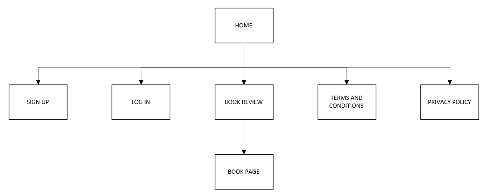

- User Logged In
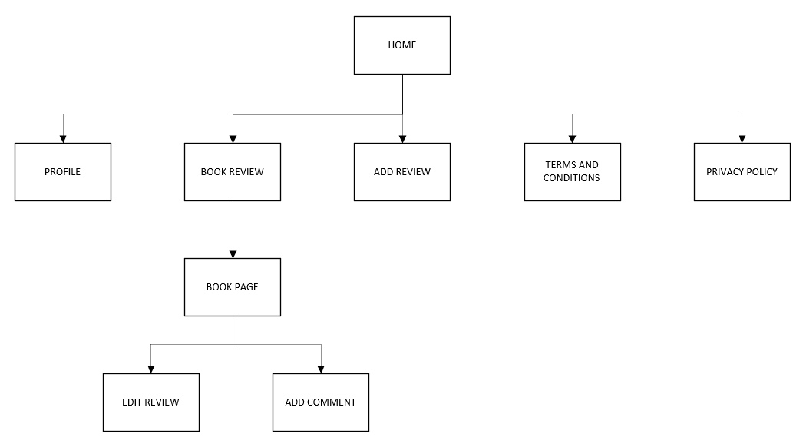

- Admin / Superuser Logged In
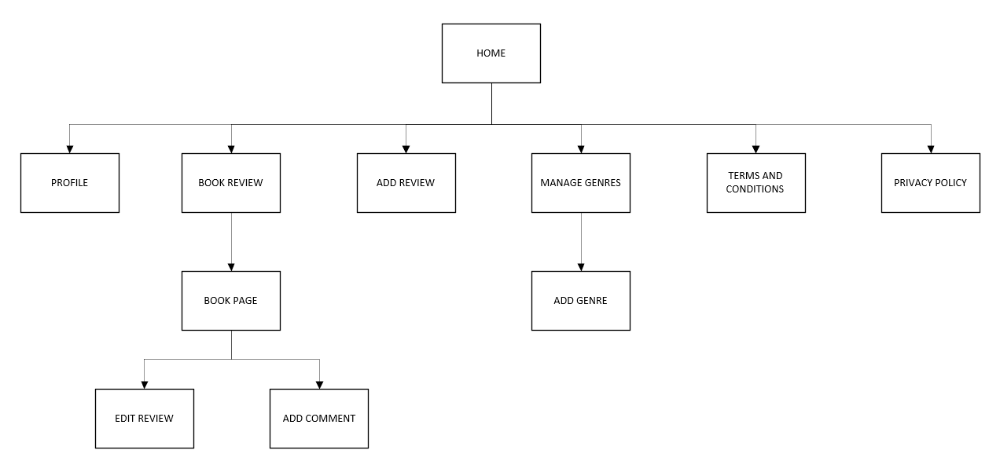


#### **Jinja Template Relationship** ####

- Template inheritance structure: 
  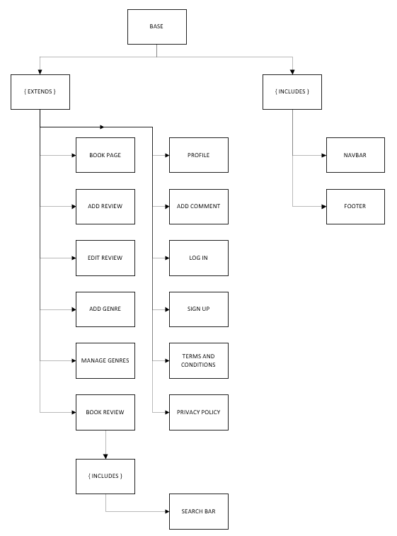


### **Page Layout** ###


#### **Responsive Navbar** ####

- Responsive Navbar changes at smaller screen sizes
  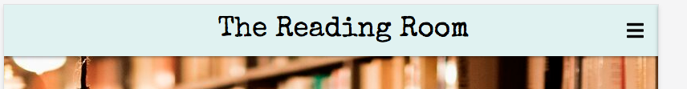


- Navbar contains the site logo
- Jinja template conditions removes menu items based on:
  - User logged in or out
  - If the user account is Admin or Superuser

  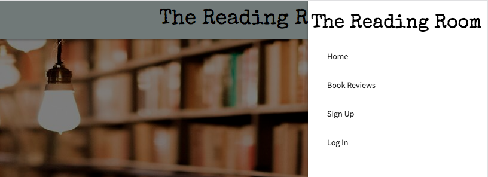

  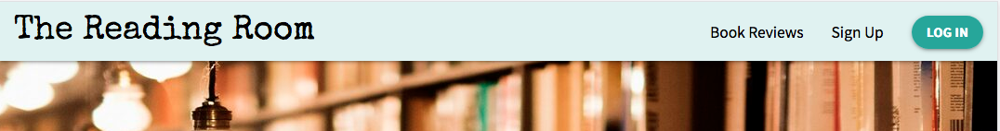
  
  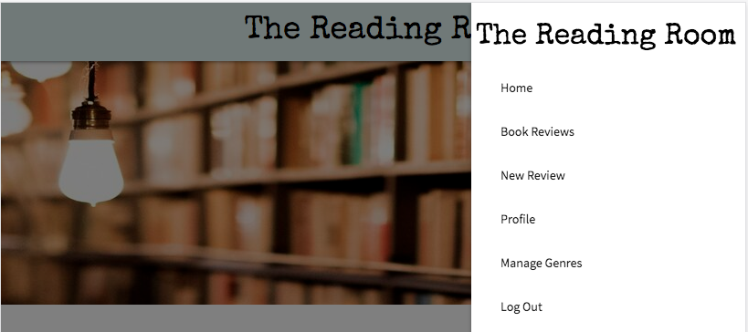

  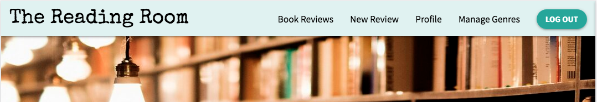


#### **Welcome Page** ####

- The welcome page contains a hero image utilising the Materialize CSS parallax feature
- The CTA container shows the visitor welcome message and button inviting the user to find out more.

  

#### **Book Review Page** ####

- The book review page shows cards containing all available book reviews
  - This page is available to all site visitors whether logged in or not.
- Each card contains a floating orange button which opens the book page for that specific book review.

- The search bar allows the user to search the available boo reviews using a text index on the book_review collection comprising the genre, author and title fields.

  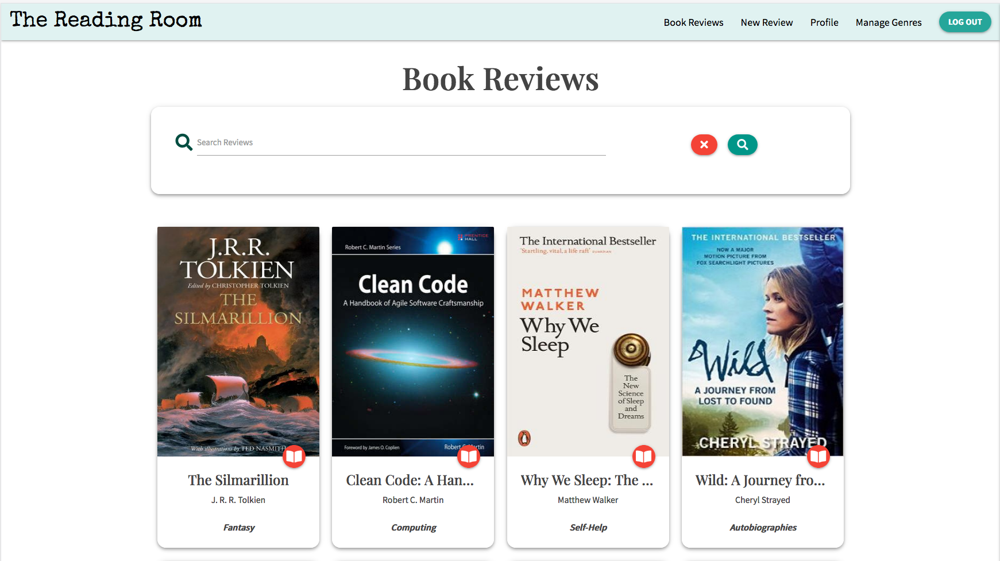

#### **Book Page** ####

- Shows the book review details containing the full book review details.

  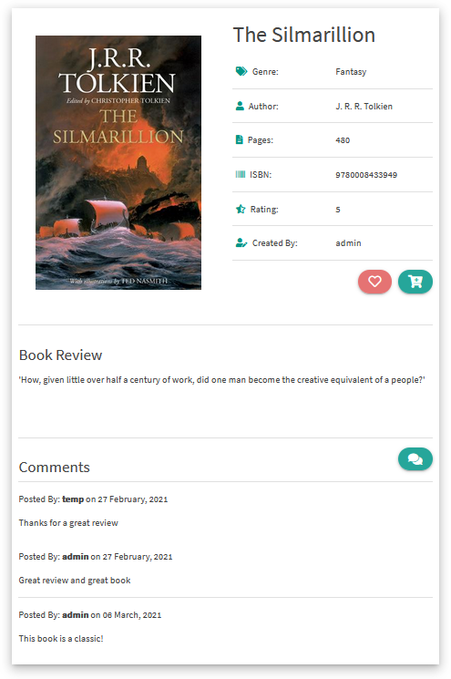

  - The book cover image URL is an optional field.
  - It was decided to serve a URL to a book cover image rather than saving a file for simplicity of demonstrating CRUD Functionality. However, as a future development, allowing the user to save an image file using the Flask-PyMongo `save_file()` and `send_file()` helpers is highly desirable.

- Allows the logged in users to create comments about the book review by linking t the create comment page.

  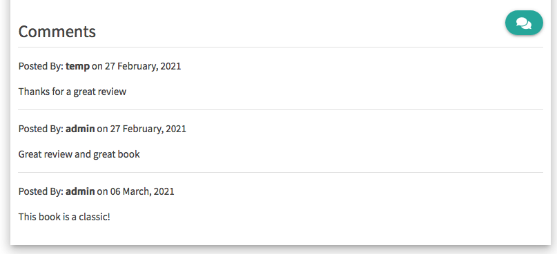

***Book Page Buttons***

  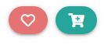

- Favourite button
  - Writes the book ID, tile and author to the users collection as an object in the favourites array.

- Shopping Cart
  - Opens the Amazon.co.uk website showing the book as a search term in the URL.
    - Saving a new book review creates a fake Amazon.co.uk affiliate link search URL using the following format:
        `https://www.amazon.co.uk/s?k=[book]+[title]+[words]&tag=faketag`
    - This format is a compromise as it only returns a general search for the book title because specific book product page uses an Amazon ASIN product number in the URL.
    - In the case of books, the Amazon ASIN number directly matches the book's shorter ISBN-10 barcode and can link directly to the book using the minimum URL format:
        `https://www.amazon.co.uk/dp/[ASIN]`
    - However, physical copies of books primarily show the longer ISBN-13 code on the back which will not work correctly if the user records that number when creating a new book review.

- Book review edit button
  - Opens the edit review page.
  - Only available if the user created the review.

  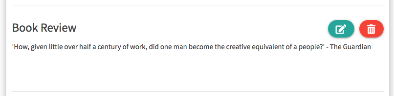


- Book Review delete button
  - Opens the edit review page.
  - Only available if the user created the review.

- Comments button
  - Opens the add comment page.
  - Only available to users logged in.

  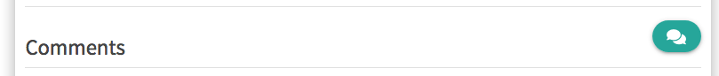

#### **Add Review Page** ####

- Users who are logged in can create new book reviews by entering the book details and a book review in the add bok review form.
  - The Choose Genre select list reads data from the genres collection.
- The ADD REVIEW button submits the form data to create a new document in the book_reviews table.

  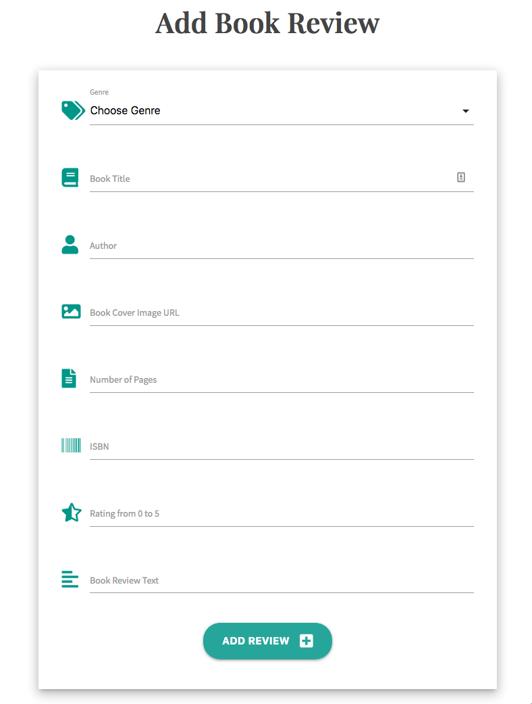


#### **Edit Review Page** ####

- Only users who created the book review are permitted to edit the review.
    - Loading the page gets the current book data from the book_review collection and pre-fills the Edit Review form.

**Edit Review Buttons**
- The red cancel button returns the user to the book review page without making any changes.
- The green edit button updates the book_review document with the new data from all the form input fields.

  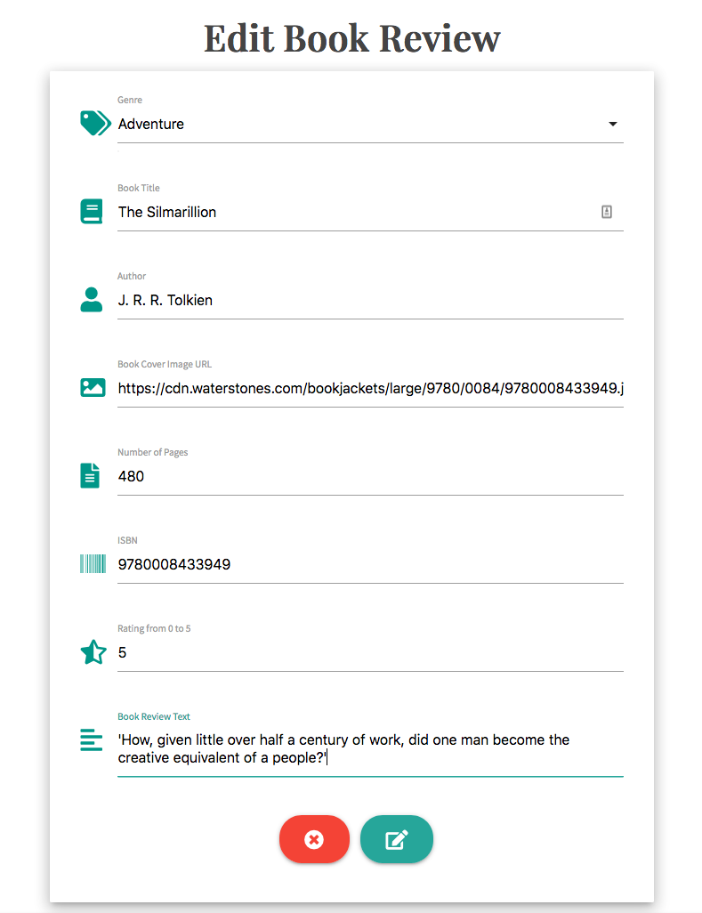

#### **User Sign Up Page** ####

- New users are encouraged to create a new account to access more site features.
  - Usernames are required to be unique and are checked against existing usernames in the users collection.
  - The user is required to complete all fields and check-box before the new user is saved to the users collection  
  - Passwords are hashed / salted before saving to the database (SHA256)
  - The member since date and last login date are also writted automatically at this point.

  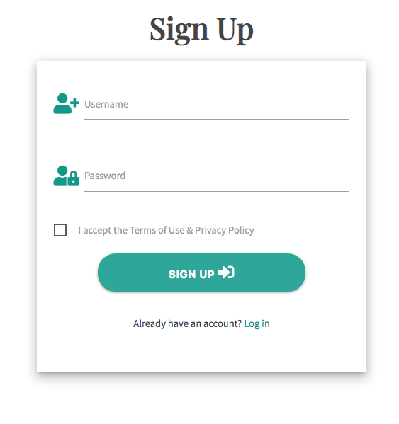

#### **User Login Page** ####

- The user name and password are validated against existing users in the users collection.
  - Users will not be allowed to log in if either the username or password are incorrect.

  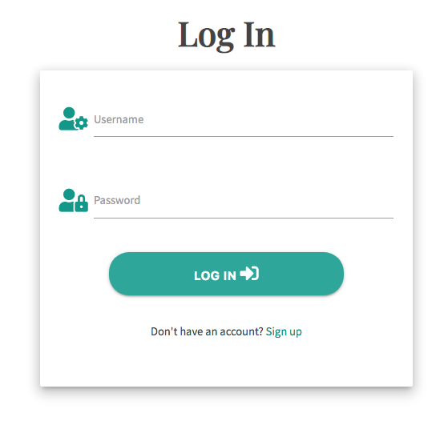

#### **Profile Page** ####

- The profile page displays the user's current account details.
- The Favourites section displays a summary of the user's favourite books
- The Book Reviews Written displays a summary of the user's submitted book reviews.

  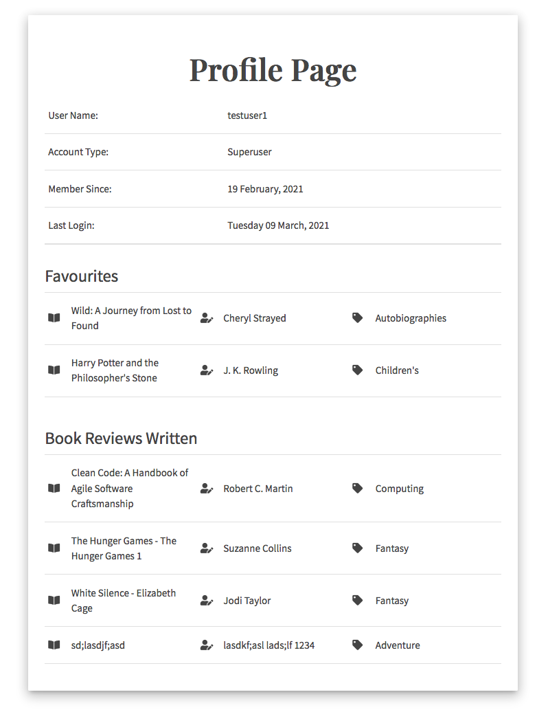

#### **Manage Genres Page** ####

- Only visible for selected users e.g. Admin or Superuser account holders.
- The page shows all current documents from the genres collection displayed in individual cards.
  - Each card has an edit and delete button for that genre document.

**Manage Genres Buttons**

- Add Genre redirects the user to the Add Genre page where a new genre category can be added
- Edit button redirects the user to the Edit Genre page where the genre name chan be updated
- Delete button deletes the genre category from the genre collection.

  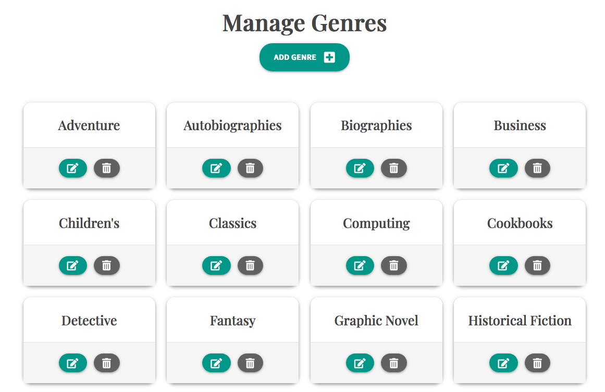

#### **Add Genre Page** ####

- Allows the admin or superuser to create a new genre category
- The Add Genre button writes the genre_name to the new genre document.

  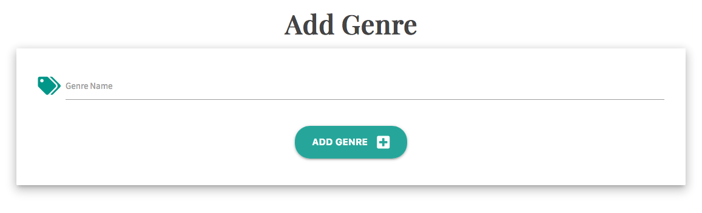

#### **Edit Genre Page** ####

- Allows the admin or superuser to edit an existing genre category
    - Loading the page gets the current genre_name from the genres collection and pre-fills the Edit Genre form.

**Edit Genre Buttons**
- The red cancel button returns the user to the manage genres page without making any changes.
- The green edit button updates the genres document with the new data from the form input field.

  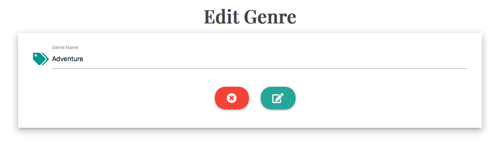

#### **Add Comment Page** ####
- Any user logged in can create a comment on any book review.
- The comment text, created date and username are saved as an object in the book_review table comments array.


  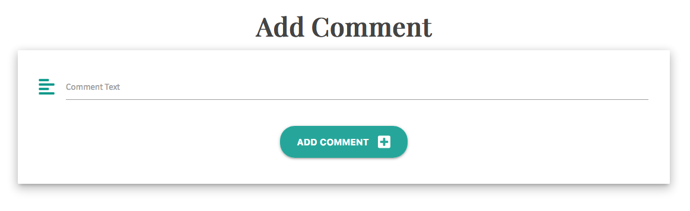


### **CRUD Functionality** ###


| Site Page | Create | Read | Update | Delete |
| --- | --- | --- | --- | --- |
| Book Review |  | All book reviews |  |  |
| Edit Review |  | Single book review | Update single book review |  |
| Book Page | Add user favourite | Single book review |  | Delete single review |
| Sign Up | Add new user |  |  |  |
| Log In |  | User details |  |  |
| Profile |  | User details |  |  |
| Profile |  | Created book reviews |  |  |
| Profile |  | Favourite reviews |  |  |
| Manage Genre |  | All genres |  | Delete genre |
| Add Genre | Add new genre |  |  |  |
| Edit Genre |  | Single genre | Update genre name |  |
| Add Comment | Add new comment |  |  |  |

### **User Alerts** ###

- Coloured Flask flash alerts are used to feedback a range of different user actions:

  - **Success**
  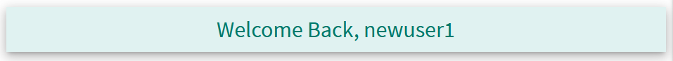
  
  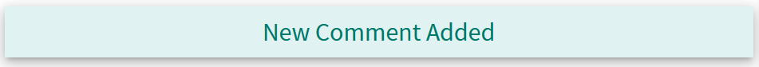
  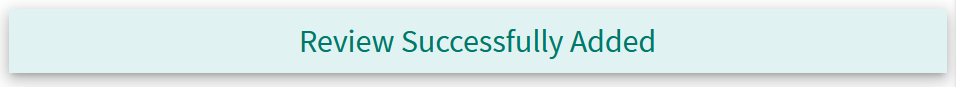
  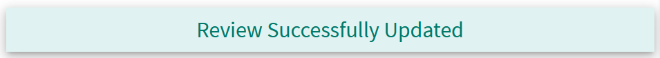

  - **Advisory**
  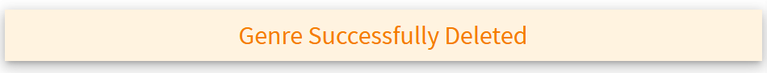
  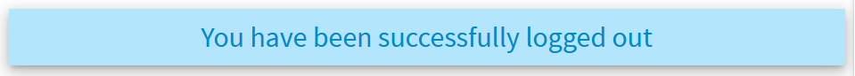
  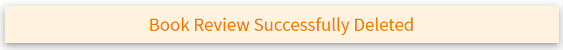


  - **Warning**
  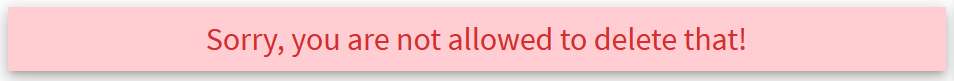
  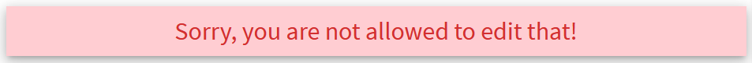
  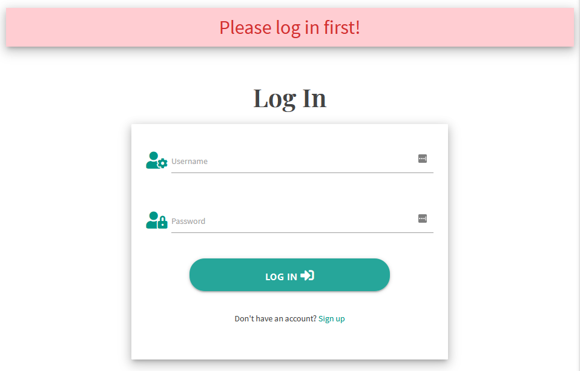

### **Defensive Programming** ###

- In order to try to maintain the site security, defensive programming to prevent "brute force" loading of restricted pages was introduced.
  - At its simplest level, certain pages are removed from view unless a user is logged in to the site.
    - This ustilises session cookies to validate whether a user is logged in or not.
  - The Python functions also contain checks on user input validity by employing if...esle statements as well as exception handling with try..except.
    - examples of this include preventing site visitors, who aren't logged in, from just entering a page URL to bypass the login process. This type of exception redirects the user to the login page with a warning flash message.


### **Additional Site features** ###


- A set of friendly HTTP Error landing pages for site visitors to see if a requested page is unavailable or cannot be accessed.
    - The pages provide a message to the user and a button to click to return the visitor to the homepage.

    - HTTP 404 Error
        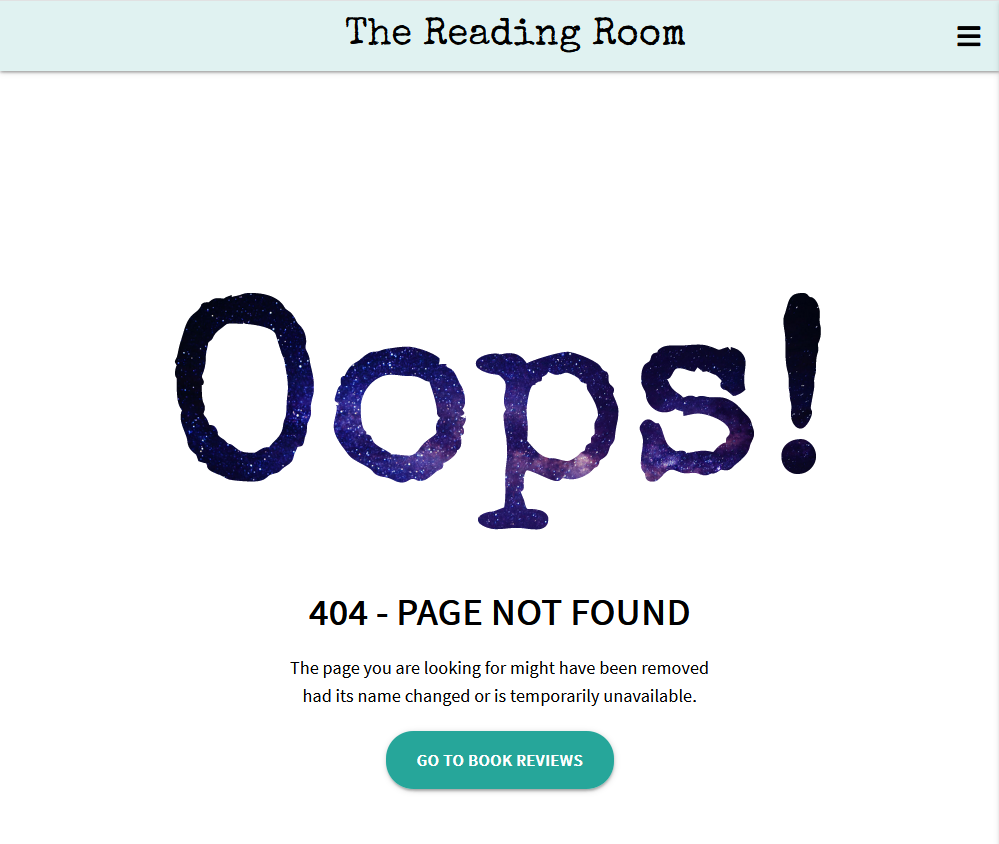
        

    - HTTP 500 Error
        

    - HTTP 503 Error
        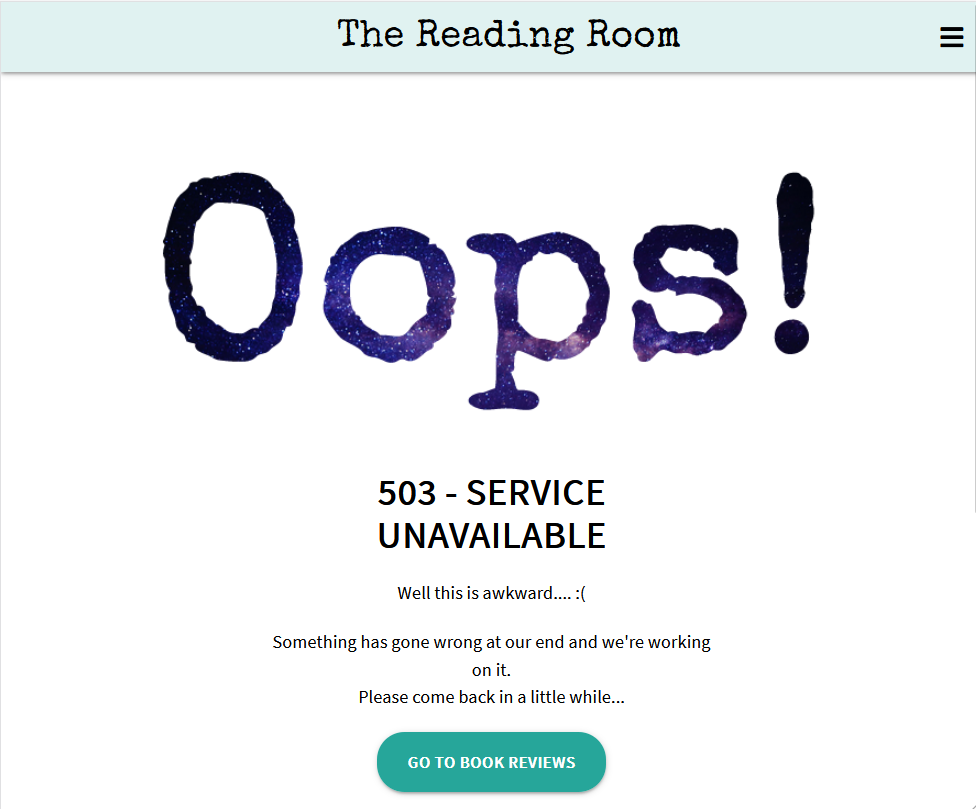


### **Future Features** ###

- Site Admin User Account administration such as:
  - User account deactivation
  - User password change
  - moderating user comments

- Allowing users to upload image files:
  - As an alternative to a URL on book reviews
  - For a profile page thumbnail image etc.
  

### **Database Design** ###


#### [genre collection](wireframes/data-schemas/book_review.json) ####


| Field Description | Collection Key | Data type |
| --- | --- | --- |
| Unique ID | _id | ObjectId |
| Genre Name | genre_name | String |


#### [users collection](wireframes/data-schemas/users.json) ####


| Field Description | Collection Key | Data type | Default Value |
| --- | --- | --- | --- |
| Unique ID | _id | ObjectId |   |
| User Name | username | string |   |
| SHA256 Hashed Password | password | String |   |
| Admin Account | is_admin | String | "off" |
| Superuser Account | is_super_user | String | "off" |
| Sign Up Date | date_joined | Date Object | utcnow() |
| Last User Login Date | last_login | Date Object | utcnow() |


#### [book_review collection](wireframes/data-schemas/book_review.json) ####


| Field Description | Collection Key | Data type | Default Value |
| --- | --- | --- | --- |
| Unique ID | _id | ObjectId |   |
| Genre Category | genre | String |   |
| Book Title | title | String |   |
| Book Author | author | String |   |
| Book Cover Image URL | image_url | String |   |
| Number of Pages | number_pages | Integer |   |
| Book ISBN-13 Number | isbn | String |   |
| Book Review Text | review | String |   |
| User Book Rating | rating | String |   |
| Created By username | create_by | String | username |
| Created Date | created_date | Date Object | utcnow() |
| Updated By | mutator | String |  |
| Updated Date | mutation | Date Object |  |
| Amazon Purchase Link | purchase_link | String | "https://www.amazon.co.uk/s?k=[book]+[title]+[words]&tag=faketag" |
| Comments Array | comments | Array |   |
| Commments Array Object | text | String |   |
| Commments Array Object | created_by | String |   |
| Commments Array Object | created_date | Date Object | utcnow() |


#### [privacy collection](wireframes/data-schemas/privacy.json) ####


| Field Description | Collection Key | Data type |
| --- | --- | --- |
| Unique ID | _id | ObjectId |
| Policy Section Title | title | String |
| Section Text Array | text | Array |
| Section Text Array Object | Index | String |


#### [terms_conditions collection](wireframes/data-schemas/) ####


| Field Description | Collection Key | Data type |
| --- | --- | --- |
| Unique ID | _id | ObjectId |
| Policy Section Title | title | String |
| Section Text Array | text | Array |
| Section Text Array Object | Index | String |


#### Data Types ####

- ObjectId
- String
- Int32
- Date
- Array
- Object


[Back to contents](#contents)

---

## SEO ##

Search Engine Optimisation for the site was provided in three complementary ways:
 - HTML Sitemap links
 - XML sitemap file saved in the root directory
 - Google Search Console
 
#### HTML Sitemap links ####
- **Secondary** HTML links to each page in the website were added to the footer section of each site page to allow users an alternative means of navigating the site easily.

#### XML Sitemap file ####
- A sitemap.xml file was created to help search engines find, crawl and index the website more easily. It was created by using XML-Sitemaps.com and entering the URL for the deployed website and letting it automatically generate the required xml data for the whole site.
The file was then saved in the GitHub repository root directory.

- The following steps were used to generate the sitemap.xml file:
  1. Visit [XML-Sitemaps.com](https://www.xml-sitemaps.com/) and enter the URL of the website https://the-reading-room.herokuapp.com/
  2. Click Start
  3. The site pages will automatically be scanned 
  4. Click View Sitemap Details
  5. Download the XML sitemap file
  6. Save the sitemap.xml file in the root directory of the GitHub repository

#### Google Search Console ####
- Google Search Console was used to assist with testing and indexing issues with the website and to see how the site performs in Google search results.

- The following steps were used to perform the indexing tests:
  1.  Visit [Google Search Console](https://www.google.com/webmasters/tools/home)
  2.  Click Add Property in the menu bar
  3.  Enter the website URL https://the-reading-room.herokuapp.com/
  4.  Click Continue
  5.  Download the unique verification file created by Google
  6.  Save the [verification file](googlef750fda78af5a952.html) in the root directory of the GitHub repository
  7.  On Google Search Console, click Verify
  8.  Once the verification passes, the site is available in the Google Search Console dashboard.

Even though this website has a small number of pages and have navigation links on each page making the Sitemap largely unnecessary, I felt is was a good experience and good practice to add these features in.
Note: I haven't added a robots.txt file yet but may add this in the future when I understand more about search engine optimisation techniques.


[Back to contents](#contents)

---

## Project Management ##

GitHub [Projects](https://github.com/simonjvardy/the-reading-room/projects) are used to organize the planning and development of the website.
Two GitHub projects are used to manage different aspects of the site development:
- [Development](https://github.com/simonjvardy/the-reading-room/projects/1)
  - Manages the project tasks and files.
- [Bug Fixes](https://github.com/simonjvardy/the-reading-room/projects/2)
  - Manages the triage and prioritization of the bug fixes.

The Projects are created using the following GitHub templates:
- `Automated kanban` template for the **Development** project.
- `Bug Triage` template for the **Bug Fixes** project.

The following kanban project cards are used to manage the tasks:
- **Backlog** - this card is used to capture ideas for project tasks.
- **To Do** - this is the current work queue for the project.
- **In Progress** - this is the list of tasks currently in work.
    - New issues and pull requests are automatically added to this column using project card automation options.
- **Testing** - Testing tasks list
- **Done** - completed tasks

The following Bug Triage template project cards are used to manage the Bux fixes tasks:
- **Needs Triage** - this card is used to capture new bugs prior to assigning a priority.
  - A triage card is more appropriate for larger projects than this but left in as this is where all new issues are assigned when linking a project to a new issue.
- **High Priority** - this is the high priority queue for the project.
- **Low Priority** - this is the low priority queue for the project.
- **Closed** - completed tasks.

Markdown syntax is used to create **"To-Do" list** style checkboxes by adding `- [ ]` for an un-ticked checkbox and `- [x]` for a ticked checkbox on cards as a way of splitting a single complex task into a list of steps to be completed.


[Back to contents](#contents)

---

## Version Control ##
**Version control** for this repository is managed within **GitHub** and **Gitpod** using separate [branches](https://github.com/simonjvardy/the-reading-room/branches)  used to work on specific aspects of the project.
The following describes the repository branch structure:
- **Master** - this is the default branch and the source for the repository deployment.
    - **Documentation** - this branch is used for updating the README.md and testing.md documentation only.
    - **Development** - this branch is used as the main working branch for the website development.
    - **Features** - this branch is used to try out new ideas and enhancements for the website.
        - Features and enhancements that are accepted are merged down into the Development branch.
    - Each individual **bug fixes** are raised within their own **separate branches** using the naming convention **\<GitHub Issue ID Number>-\<bug fix description>** e.g. branch name ***12-correct-navbar-links*** 

The following workflow steps are used to create and update branches within Gitpod and to push changes back to GitHub.


#### Gitpod Workspaces ####
1. Open **Gitpod** from **Github** using the Gitpod button. This needs to only be done **once** at the start of the project.
2. Start the Gitpod Workspace which opens an **online IDE editor** window.


#### Branches ####
3. For changes to be made to any **documentation files**, the git command `git checkout documentation` is used to checkout and switch to the **documentation branch**.
4. For changes to be made to **other files** under normal site development, the git command `git checkout development` is used to checkout and switch to the **development branch**.
5. For changes to be made to new files for site enhancements, the git command `git checkout features` is used to checkout and switch to the **features branch**.
6. To create a **new branch** for bug fixes, use the git command `git checkout -b <branch-name>` to **create and switch** to the new branch.


#### Working within a branch ####
7. **New** or **modified** files are **staged** using the `git add .` command
8. The changes are **committed** using `git commit -m "<commit message>"` command.
9. If the changes are in a newly created branch, the **committed** changes are **pushed** from Gitpod to GitHub using the `git push --set-upstream origin <branch-name>` command as there is currently no upstream branch in the remote repository.
10. For branches that have already been synchronized, the **committed** changes are **pushed** from Gitpod to GitHub using the `git push` command.


#### Merging branches in GitHub ####
11. Opening the repository in Github, a new **pull request** is created for the updated branch and assigned to its related **Development**, **Development - JavaScript** or **Bug Fixes** project.
12. The changes are **reviewed** to ensure there are **no conflicts** between the **updated branch** and the **Master branch**.
13. The changes are then **merged** into the **Master branch** and the merge request is **closed**. The **Project entry** is **automatically** moved to the **Done** card.


#### Update Gitpod with the latest GitHub commits ####
14. To update Gitpod with the **latest commits** From GitHub, the `git checkout master` command is used to checkout and switch to the master branch.
15. Use the `git pull` command to update the master branch and **reset the pointer**.
16. Now **switch** to the **other branches** in Gitpod using the `git checkout <branch-name>` command and use the `git merge origin/master` command to **update each branch in turn**.
17. Use the `git push` on **each branch** to update the relevant GiHub Branches to the **same commit** as the **Master branch**.
18. **Repeat steps 3 - 17 regularly** to ensure updates are **saved** and **correctly version controlled** in GitHub.


[Back to contents](#contents)

---
## Testing ##

- Testing information can be found in a separate [testing.md](testing.md) file.


[Back to contents](#contents)

---
## Bugs ##

To manage bugs and issues tracking, the default GitHub [bug_report.md template](https://github.com/simonjvardy/the-reading-room/blob/master/.github/ISSUE_TEMPLATE/bug_report.md) has been created and activated within the repository settings Features > Issues section.
All new bugs and issues are tracked within the GitHub repository [Issues section](https://github.com/simonjvardy/the-reading-room/issues) .
Open issues are managed within the [GitHub Projects section](https://github.com/simonjvardy/the-reading-room/projects)

Each branch is then **merged** into the **master branch** using a **pull request** that is **linked** to the **open issue**. Once merged, and the bug report **closed**, the branch is **deleted**.

Fixed bugs and issues are marked as [closed](https://github.com/simonjvardy/the-reading-room/issues?q=is%3Aissue+is%3Aclosed).


[Back to contents](#contents)

---

## Deployment ##

The website was developed using both *Gitpod* and *Visual Studio Code* and using *Git* pushed to *GitHub*, which hosts the repository. I made the following steps to deploy the site using *Heroku*:


### **Cloning the-reading-room from GitHub** ###

#### Prerequisites ####

Ensure the following are installed locally on your computer:
- [Python 3.6 or higher](https://www.python.org/download/releases/3.0/)
- [PIP3](https://pypi.org/project/pip/) Python package installer
- [Git](https://git-scm.com/) Version Control


#### Cloning the GitHub repository ####


- Navigate to **simonjvardy/the-reading-room**.
- Click the **Code** button.
- **Copy** the url in the dropdown box.
- Using your favourite **IDE** open up your preferred terminal.
- **Navigate** to your desired file location.

Copy the following code and input it into your terminal to clone the-reading-room:

```
git clone https://github.com/simonjvardy/the-reading-room.git
```

#### Creation of a Python Virtual Environment ####

*Note: The process may be different depending upon your own OS - please follow this [Python help guide](https://python.readthedocs.io/en/latest/library/venv.html)
to understand how to create a virtual environment*

#### Install the App dependencies and external libraries ####

- In your IDE terminal window, install the dependencies from the requirements.txt file with the following command:

```
pip3 install -r requirements.txt
```

#### Create the database in MongoDB #####

*Please ensure you have an account created at [MongoDB](https://account.mongodb.com/) in order to build the database*

- In your MongoDB cluster, create a new database called `the-reading-room`
- Create the following collections within the new database:
  - [book_review](wireframes/data-schemas/book_review.json)
  - [genre](wireframes/data-schemas/genre.json)
  - [users](wireframes/data-schemas/users.json)
  - [terms_conditions](wireframes/data-schemas/terms_conditions.json)
  - [privacy](wireframes/data-schemas/privacy.json)


#### Create `env.py` file ####

- The `env.py` file should contain at least the following information:

```
import os

os.environ.setdefault("IP", "0.0.0.0")
os.environ.setdefault("PORT", "5000")
os.environ.setdefault("SECRET_KEY", "YOUR_OWN_SECRET_KEY")
os.environ.setdefault("MONGO_URI", "YOUR_OWN_MONGODB_URI")
os.environ.setdefault("MONGO_DBNAME", "YOUR_OWN_MONGODB_DATABASE_NAME")
```

- Please ensure you add in your own `SECRET_KEY`, `MONGO_URI` and `MONGO_DBNAME` values.
- ***Important:*** Add the `env.py` file to your `.gitignore` file before pushing your files to any public git repository.

#### Run the application ####

- To run the application enter the following command into the terminal window:

```
python3 app.py
```

### **Deploying The Reading Room app to Heroku** ###

#### Create the Heroku App ####

*Please ensure you have an account created at [Heroku](https://signup.heroku.com/login) in order to deploy the app*

- Log in to your Heroku account dashboard and create a new app.
- Enter the App name. 
  - This needs to be unique and the-reading-room is already in use so choose a suitable alternative name for your own App.
- Choose a geographical region closest to where you live.
  - Options available on a free account are ***United States*** or ***Europe***


#### Push your repository to GitHub ####

- Commit and push your local repository to your GitHub linked repsitory

- Ensure your local git repository has the following files in the root directory:

  - Heroku `Procfile`
  - `requirements.txt`

- If these are not showing in your local Git repository for any reason, enter the following commands in the terminal window:

```
echo web: python app.py > Procfile
pip3 freeze --local > requirements.txt
```

- Stage, commit and push your local Git repository to GitHub

#### Connect Heroku to GitHub ####

- In the Heroku App Settings page, open the section Config Vars
- Add all the environmant variables from your local `env.py` file into the Heroku Config Vars:


| Key | Value |
| --- | --- |
| IP | 0.0.0.0 |
| PORT | 5000 |
| SECRET_KEY | YOUR_OWN_SECRET_KEY |
| MONGO_URI | YOUR_OWN_MONGODB_URI |
| MONGO_DBNAME | YOUR_OWN_MONGODB_DATABASE_NAME |


- In the Heroku App Deploy page: 
  - Select GitHub from the Deployment Method options.
  - Select Connect to GitHub.
  - Log in to your GitHub account from Heroku to link the App to GitHub.
  - Search for and select the repository to be linked in Github.
  - Select Connect.
  - Select Enable Automatic Deployment from the GitHub Master / Main branch


#### Launch the App ####

- Click Open App in Heroku to launch the App in a new browser window.


[Back to contents](#contents)

---

## Credits ##

### **Images** ###

You can find the images used for the site [here](static/images). I have sourced them through various websites, which are either free to use or used under license:

- Welcome Page
  - The Background [Hero Image](static/images/bookshelf-1920x1080.jpg) was free to use, sourced from [PIXNIO](https://pixnio.com/objects/books/bookcase-books-bookshelves-education-research-school-study) 

- Book Review


All demonstration book review image URLs were sourced from [Waterstones](https://www.waterstones.com/) online bookstore (© Waterstones, 2021. Waterstones Booksellers Limited - All Rights Reserved) from their CDN image delivery URLs and used purely for educational purposes only to demonstrate the app backend CRUD functionality. Please visit [Waterstones](https://www.waterstones.com/) for some fantastic deals on the latest books! 

  - [Silmarillion](https://cdn.waterstones.com/bookjackets/large/9780/0084/9780008433949.jpg)
  - [Clean Code: A Handbook of Agile Software Craftsmanship](https://cdn.waterstones.com/bookjackets/large/9780/1323/9780132350884.jpg)
  - [Why We Sleep: The New Science of Sleep and Dreams](https://cdn.waterstones.com/bookjackets/large/9780/1419/9780141983769.jpg)
  - [Wild: A Journey from Lost to Found](https://cdn.waterstones.com/override/v1/large/9781/7823/9781782394860.jpg)
  - [The Hunger Games - The Hunger Games 1](https://cdn.waterstones.com/bookjackets/large/9781/4071/9781407132082.jpg)
  - [White Silence - Elizabeth Cage](https://cdn.waterstones.com/bookjackets/large/9781/4722/9781472264480.jpg)
  - [The Fear Bubble: Harness Fear and Live without Limits](https://cdn.waterstones.com/bookjackets/large/9780/0081/9780008194680.jpg)
  - [Harry Potter and the Philosopher's Stone](https://cdn.waterstones.com/bookjackets/large/9781/4088/9781408855652.jpg)
  - [Gangsta Granny](https://cdn.waterstones.com/bookjackets/large/9780/0073/9780007371464.jpg)
  - [The Martian: Stranded on Mars, one astronaut fights to survive](https://cdn.waterstones.com/override/v3/large/9781/7850/9781785031137.jpg)
  - [A Promised Land](https://cdn.waterstones.com/override/v4/large/9780/2414/9780241491515.jpg)


- 404
  - The [Error 404 Text Background Image](static/images/bg.jpg) was sourced from [Colorlib](https://colorlib.com/wp/free-404-error-page-templates/) as part of a template licensed under CC BY 3.0

### **Colour** ###

- The colour palette was identified on [Coolors](https://coolors.co/)


### **Inspiration** ###

The following websites were used as the starting point and inspiration for creating the website:

- [Waterstones]() Online book store for website design inspiration and features as well as URL links to their book pages.
- [Amazon UK]() Online retailer for website design inspiration and features as well as URL links to their book pages.
- [Kirkus](https://www.kirkusreviews.com/) Book Review website / blog for design inspiration and content ideas.
- [Instagram - Duchess Of Cornwall](https://www.instagram.com/duchessofcornwallsreadingroom/?hl=en) Instagram Book Club / Book review site

### **Acknowledgements** ###

- [Simon Vardy](https://github.com/simonjvardy/) MS-1 & MS-2 Projects for the re-use of many ideas, site pages and code snippets.
- [Richard Read](https://github.com/Readri205/MS2_Project) for project inspiration and README.md format ideas.
- [Neringa Bickmore](https://github.com/neringabickmore/scribbles) for project inspiration and README.md content ideas.
- [W3Schools](https://www.w3schools.com/) for just being a constant source of help and inspiration!
  - [W3Schools](https://www.w3schools.com/python/python_datetime.asp) for help working with Python datetime functions.
- [Code Institute](https://codeinstitute.net/full-stack-software-development-diploma/) Course material for the inspiration from code-along challenges, specifically the Task Manager and Thorin Flask apps.
- [Jinja Template Designer Documentation](https://jinja.palletsprojects.com/en/2.11.x/templates/) for loads of help and ideas.
- [San Francisco State University](https://its.sfsu.edu/projects/resources) PMO Resources webpage where the original Unit Testing and UAT Testing Plan documents were sourced
- [usersnap.com blog](https://usersnap.com/blog/user-acceptance-testing-example/) which was the inspiration for the modified UAT Testing document and wording.
- [Software Testing Fundamentals (STF)](http://softwaretestingfundamentals.com/) for an excellent guide on building testing processes.
- [Git - Branching and Merging](https://git-scm.com/book/en/v2/Git-Branching-Basic-Branching-and-Merging) documentation for help understanding how to manage branches in GitHub / Gitpod.
- [digitaljhelms](https://gist.github.com/digitaljhelms/4287848) for ideas and help with GitHub branch naming conventions.
- [GitHub](https://docs.github.com/en/free-pro-team@latest/github/working-with-github-pages/creating-a-custom-404-page-for-your-github-pages-site) Help guide on using Error 404 pages on repositories.
- [Colorlib](https://colorlib.com) the 404.html was adapted from a template made by Colorlib. Go visit their website for more awesome templates, themes and tools.
- [Tutorials Point](https://www.tutorialspoint.com/How-to-prepare-a-Python-date-object-to-be-inserted-into-MongoDB) for help with writing timestamps data to MongoDB.
- [JoeHx Blog](https://www.joehxblog.com/amazon-url-anatomy-dissection/) Dissecting the Amazon URL anatomy
- [GeeksForGeeks](https://www.geeksforgeeks.org/python-404-error-handling-in-flask/) Python 404 error handling in Flask
- [Python.org](https://python.readthedocs.io/en/latest/library/venv.html) Python VENV virtual environments documentation
- [Codementor](https://www.codementor.io/@prasadsaya/working-with-arrays-in-mongodb-16s303gkd3)
- [Nielsen BookData](https://nielsenbook.co.uk/) Origin of the book jacket images supplied by Waterstones CDN
- [Stack Overflow](https://stackoverflow.com/) For help fixing so many thing that fell over on this project!
  - [Stack Overflow](https://stackoverflow.com/questions/273695/what-are-some-examples-of-commonly-used-practices-for-naming-git-branches) for ideas and help with GitHub branch naming conventions.
  - [Stack Overflow](https://stackoverflow.com/questions/17575276/how-can-i-print-a-mongodb-list-in-a-jinja2-template) ofr Jinja2 MongoBD list iteration help.
  - [Stack Overflow](https://stackoverflow.com/questions/14026392/insert-current-time-into-mongo-using-pymongo) for help with writing timestamps data to MongoDB.
  - [Stack Overflow](https://stackoverflow.com/questions/4174941/how-to-sort-a-list-of-lists-by-a-specific-index-of-the-inner-list) How to sort a list of tuples by a specific index of the inner list.
  - [Stack Overflow](https://stackoverflow.com/questions/54094178/sorting-datetime-object-in-a-list-of-tuples) Sorting datetime objects in a list of tuples
  - [Stack Overflow](https://stackoverflow.com/questions/31034699/how-to-push-new-items-to-an-array-inside-of-an-object) Pushing new items to an array inside of an object
  - [Stack Overflow](https://stackoverflow.com/questions/36174320/how-to-disable-button-using-jquery-in-materialize-css) Disable Materialize CSS Buttons with jQuery
- [Flask](https://flask.palletsprojects.com/en/1.1.x/)
  - [Flashed Messages](https://flask.palletsprojects.com/en/1.1.x/patterns/flashing/) example code was copied and adapted for flashed messages.
  - [Flask Docs](https://flask.palletsprojects.com/en/1.1.x/patterns/viewdecorators/) View Decorators
- [Werkzeug](https://werkzeug.palletsprojects.com/en/1.0.x/)
  - [Security Helpers](https://werkzeug.palletsprojects.com/en/1.0.x/utils/#module-werkzeug.security) code copied and adapted for user pasword hashing.
- [Materialize CSS](https://materializecss.com/)
  - [Cards](https://materializecss.com/cards.html) example code was copied and adapted for the Help Page.
  - [Forms](https://materializecss.com/)
    - [Text Input](https://materializecss.com/text-inputs.html) example code was copied and adapted for many of the pages from log in to adding reviews.
    - [Checkboxes](https://materializecss.com/checkboxes.html) example code was copied and adapted for sign up page.
  - [Carousel](https://materializecss.com/carousel.html) example code was copied and adapted for the home page
  - [Accordion](https://materializecss.com/collapsible.html) example code was copied and adapted for the T&C & Privacy Policy pages.
  

[Back to contents](#contents)

---
