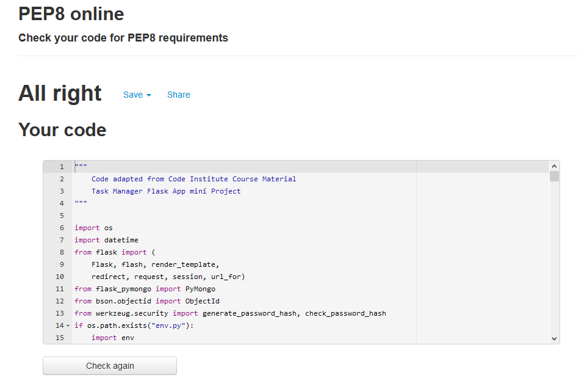
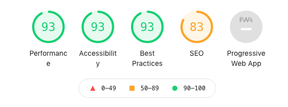
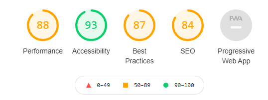

# The Reading Room Project Testing Details #

[Main README.md file](https://github.com/simonjvardy/the-reading-room/blob/master/README.md)

[View the live project here.](http://the-reading-room.herokuapp.com/welcome)

---

## Table of Contents ##

- [The Reading Room Project Testing Details](#the-reading-room-project-testing-details)
  - [Table of Contents](#table-of-contents)
  - [Automated Testing](#automated-testing)
    - [Validation Services](#validation-services)
  - [Manual Testing](#manual-testing)
    - [Unit Testing](#unit-testing)
    - [Testing undertaken on desktop](#testing-undertaken-on-desktop)
    - [Testing undertaken on tablet and phone devices](#testing-undertaken-on-tablet-and-phone-devices)
  - [Bugs discovered](#bugs-discovered)
      - [Known Bugs](#known-bugs)
      - [Unsolved Issues](#unsolved-issues)

---
## Automated Testing ##

### Validation Services ###

The following **validation services** and **linters** were used to check the validity of the website code.

- [W3C CSS Validation Service](https://jigsaw.w3.org/css-validator/)
  - This validator checks the validity of cascading style sheets (css) and (X)HTML documents with style sheets.
    

- [W3C Markup Validator](https://validator.w3.org/)
  - This validator checks the markup validity of Web documents in HTML, XHTML, SMIL, MathML, etc.
  - The warning relates to a section containing Jinja2 templating language for the Flask flash messages.
    

- [PEP8 Online validation](http://pep8online.com/checkresult)
  - This linter checks the validity of Python code against the PEP8 requirements
    

- [Chrome DevTools Lighthouse](https://developers.google.com/web/tools/lighthouse)
  - An open-source automated tool for improving webpages by running audits for performance, accessibility, progressive web apps, SEO etc.

  - Desktop Performance
    
  
  - Mobile Performance
    

  - The Lighthouse 'Best Practices' score was variable due to the 3rd party image  from Waterstones CDN being caught by the 
    Chrome DevTools SameSite cookie policy treating the image links under cross-site cookie settings.

---
## Manual Testing ##

### Unit Testing ###
[Unit Testing document](testing/MS3-unit-test-plan.pdf) containing:
- Unit Test scope,
- The test cases,
- The pass / fail record for each test case.

### Testing undertaken on desktop ###

- Hardware:
    - Macbook Pro Laptop 17" (2009)
    - Dell 5590 Laptop
- Tested Operating Systems:
    - Windows 10
    - OSX 10.11 
- Tested Browsers:
    - Windows 10:
        - Chrome
        - Firefox
        - Edge 
    - OSX 10.11
        - Chrome
        - Firefox
        - Safari

### Testing undertaken on tablet and phone devices ###

- Hardware:
    - iPad Pro 12.9"
    - iPad Pro 10.5"
    - iPhone XS Max
- Tested Operating Systems:
    - iOS 14.4
    - iPadOS 14.4
- Tested Browsers:
    - iOS / iPadOS
        - Chrome
        - Firefox
        - Edge
        - Safari

---
## Bugs discovered ##

The issue log is managed on the [GitHub Project Issues section](https://github.com/simonjvardy/the-reading-room/issues) using the standard GitHub [bug\_report.md template](https://github.com/simonjvardy/the-reading-room/blob/master/.github/ISSUE_TEMPLATE/bug_report.md)
and the [features_request.md template](https://github.com/simonjvardy/the-reading-room/blob/master/.github/ISSUE_TEMPLATE/feature_request.md)

#### Known Bugs ####

#### Unsolved Issues ####

[Issue #27](https://github.com/simonjvardy/alarm-clock/issues/4)
- **Feature: How can the user account be set up as a Super User or Admin?**
  - This is more of a functionality enhancement that an issue.
  - The users documents contain `is_admin` and `is_super_user` flags on each user account. The default is set to 'off'.
  - The usefulness of these flags weren't fully made use of in the app for restricting access to certain functions.
    - Flask-Security may be a better option for creating user role management.

[Issue #51:](https://github.com/simonjvardy/the-reading-room/issues/51)
- **Unit Testing: Favourite button adds same book multiple times**
  - The book page favourite button functionality current doesn't disable the button after a user has clicked the  button once.
  - This means the button could be clicked continuously and keep adding the same favourite book to the users collection document
  - The button styling classes were changed using jQuery on click but this wasn't successfully implemented.
